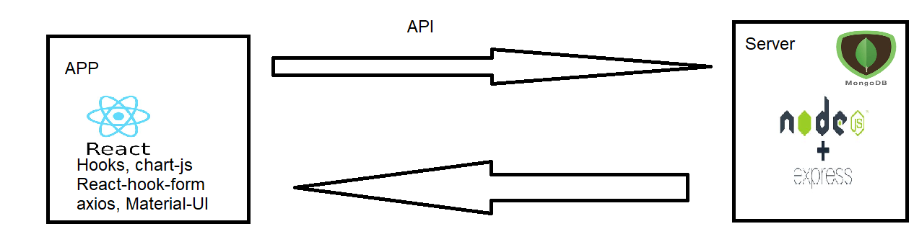

## about

CRUD SPA
Demo: https://crudotest.herokuapp.com/

## Acrhitecture

 

## Tech used

MERN

react hooks, react-hook-form, chart.js, axios, react-router-dom

## install

download> cd to it>
create .env file
with
MONGODB_URI = {your mongodb}
NODE_ENV = development
>npm install
>in cli>nodemon server.js
in browser goto >localhost:3001
enjoy

